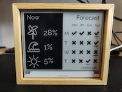
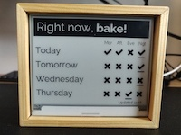
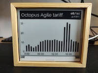
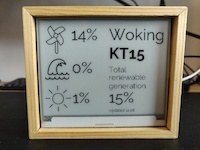
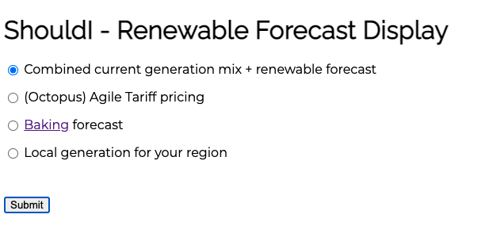
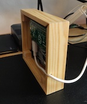

# GB Renewable Forecast Display
   

This Raspberry Pi powered eInk display aims to give you a quick way to time your home energy usage to help balance the grid, reduce carbon emissions, and if you're an [agile tariff user](https://octopus.energy/agile/), save money.

The project takes the same approach as [shouldibake.com](http://shouldibake.com/) and the [Baking Forecast GB](https://twitter.com/baking4cast) to give you quick visual aid when making that decision, showing you when renewable generation is above or below 33%.

Data is provided by the [National Grid's carbon intensity api](https://carbonintensity.org.uk/) and [Octopus Energy's Agile tariff pricing API](https://developer.octopus.energy/docs/api/#list-tariff-charges)

## Components
1. Raspberry Pi Zero soldered (~£14) ([piehut](https://thepihut.com/products/raspberry-pi-zero-wh-with-pre-soldered-header) | [pimoroni](https://shop.pimoroni.com/products/raspberry-pi-zero-wh-with-pre-soldered-header))
2. Micro SD card (~£7) ([piehut](https://thepihut.com/collections/raspberry-pi-sd-cards-and-adapters/products/noobs-preinstalled-sd-card) | [pimoroni](https://shop.pimoroni.com/products/noobs-32gb-microsd-card-3-1?variant=31703694245971))
3. Inky wHAT (ePaper/eInk/EPD) - Black/White (£45) ([piehut](https://thepihut.com/products/inky-what-epaper-eink-epd-black-white) | [pimoroni](https://shop.pimoroni.com/products/inky-what?variant=21214020436051))
4. Power supply - micro USB connection ([piehut](https://thepihut.com/products/official-raspberry-pi-universal-power-supply) | [pimoroni](https://shop.pimoroni.com/products/raspberry-pi-universal-power-supply) - or use an existing cable) 
5. [Case](#case) (see notes below)

## Install and setup

### Raspberry Pi Setup

I use a "headless" Raspberry Pi setup to install all the dependencies; we configure the wifi settings prior to powering on the 
Pi & enable SSH by default, this mean we avoid having to connect a display or a keyboard.

### 1. Flash pi with Raspberry Pi OS lite (no desktop)
* Use [Raspberry Pi Imager](https://www.raspberrypi.org/software/) 
* Select SD card
* Choose "Raspberry Pi OS (other)" > "Raspberry Pi OS Lite (32-bit)" (we dont require a GUI desktop)
* Select write & wait for the OS to be written to the SD card.

### 2. Configure Wifi & Enable SSH (create file /Volumes/boot/ssh)
* Once the Rapsberry Pi OS image has been saved to the SD card, open a file window so that you can view the contents of the SD card's 'boot' folder
* Create a new file `wpa_supplicant.conf` in the root of the boot folder & add the following, replacing the relevant sections with your SSID and password for your wifi network
```
  ctrl_interface=DIR=/var/run/wpa_supplicant GROUP=netdev
  network={
    ssid="YOUR_SSID"
    psk="YOUR_WIFI_PASSWORD"
    key_mgmt=WPA-PSK
  }
```
Example file: [conf/wpa_supplicant.conf](https://github.com/openbook/shouldi-eink-display/blob/main/conf/wpa_supplicant.conf)
* Finally create an empty file called 'ssh' (without a file extension) in the boot directory, this will enable SSH by default when you first power on the pi
  
### 3. Power on the pi and SSH onto the device
* Insert the SD card into the Raspberry Pi
* Install the Raspberry Pi into the back of the Inky display
* Power on the Pi & wait for ~2 minutes whilst the operating system boots up.  
* If this is the only Raspberry Pi on your network you'll able to access the Pi using the device's hostname with following SSH command  
```bash
ssh pi@raspberrypi.local
password=raspberry
```
otherwise, you will need to find the IP of your Pi via your local network router then start a SSH session using
```bash
ssh pi@[IP ADDRESS]
password=raspberry
```

### 4. Run the install script
* In your SSH terminal, ensure you're first in the pi user's home directory by running `cd ~/`
* Install the dependencies for both the Inky display & the api/drawing libraries by running the following command 
  
```curl https://raw.githubusercontent.com/openbook/shouldi-eink-display/main/install.sh | bash```
* When prompted enter Y to install the required inky libraries
* When prompted 'Do you wish to perform a full install?' enter N 

### 5. Set the display configuration
By default the 'combined' forecast and current generation mix is displayed.  Full info on each of the screens is [available here](#displays).
You can update the display by changing the values found within the 'config.ini' that was downloaded as part of the setup:
* Using a text update the contents of the file found at `/home/pi/shouldi-eink-display/config.ini`
* Update the `display = combined` line choosing one of the following options:
    * combined - renewable forecast plus current generation mix
    * forecast - the full "should i bake" forecast
    * agile - agile tariff hourly prices for the current day
    * generation - current renable generation mix for a local area
* If selecting "agile" then the postcode and placename should be changed from the current values in the same file.  **Note** postcodes should be added using the first half only (e.g. for SW1A 0AA use SW1A)
* see '#displays' for notes on each display screen


### 6. (Optionally) control the display config using a webform hosted on the Pi 


With a few more additions, you can also create a simple web form which will allow you to switch the current display view using a browser. 

* still using the SSH session, make sure you are in the project root folder `cd ~/shouldi-eink-display`
* run `./install-web.sh` this will setup an nginx webserver and serve a simple flask based webapp that will allow you to update the config.ini file.
* Once the install script has finished, it should confirm the IP address of your Pi - you can then open that IP address in a browser to access the web interface shown above 

### 7. :tada: Done
Hopefully everything should be setup and working ok.  

Your display is set to update automatically at 5 & 35 minutes past each hour.  

## [Screens](#displays)

#### Combined current generation mix + renewable forecast
 

* **"Now"** - how much of the current electricity supply, coming from the National Grid, is being generated from renewable sources (wind, hydro & solar)
* **"Forecast"** - for the next (up to) 4 days, which slots (morning, afternoon, evening or night) are forecasted to have renewable generation higher than 33%
  * where there's a tick, generation is forecasted to be greater than 33%
  * where there's a cross, generation is forecasted to be lower than 33%, avoid doing any activities at home which consume a lot of electricity during these times if you can
  * where the tick or cross is underlined - this shows the period during the day which is forecasted to have the highest renewable generation.  Try to plan your high demand activities for these time. 

#### (Octopus) Agile Tariff pricing
 
* Displays the cost p/kWh (pence per kilowatt hour) for each hour over the current day.
* See the full [documentation here](https://developer.octopus.energy/docs/api/#list-tariff-charges) for more information 

#### Baking forecast
 
* **"Right now, Bake!"/"Can baking wait?"** - tells you whether the current renewable generation level is higher than 33%
* **"Forecast"** - for the next (up to) 4 days, which slots (morning, afternoon, evening or night) are forecasted to have renewable generation higher than 33%
  * where there's a tick, generation is forecasted to be greater than 33%
  * where there's a cross, generation is forecasted to be lower than 33%, avoid doing any activities at home which consume a lot of electricity during these times if you can
  * where the tick or cross is underlined - this shows the period during the day which is forecasted to have the highest renewable generation.  Try to plan your high demand activities for these time.

#### Local generation for your region

* Using a postcode supplied in the config.ini file, this display shows the current generation mix specific to your region. 

## [Case](#case)

### Make your own
 

I created a simple frame using some pine stripwood (6x25mm), which was then treated with danish oil.  This works well and with a 
small cut out for the USB power cable sits flush against a wall when fixed with a nail.

### Modeled and 3d printed LargeCover enclosure by [Printminion](https://twitter.com/printminion)

This is a great professional looking case that's ready to buy and simple to install.  

**Note**, unless you are going to [solder the pi to the inky manually](https://youtu.be/q5ER7cTRDVo) then you'll need the 'enclosure' + 'large cover'.  

* [Details on twitter](https://twitter.com/printminion/status/1170751384800714753)
* [3d print files on thingverse.com](https://www.thingiverse.com/thing:3325556)
* [Buy enclosure](https://www.shapeways.com/product/FB38M3F8G/enclosure-for-pimoroni-inky-what-and-raspberry-pi?optionId=83324972) & [large cover](https://www.shapeways.com/product/GGAD2ERJP/largecover-for-pimoroni-inky-what-and-raspberry-pi?optionId=121238893) on Shapeways 


## To do
- [ ] Add a physical button to switch between displays
- [ ] Add error handling for all outgoing requests
- [ ] Image uploader for custom screen of when generation is high and low
- [ ] Move carbonintensitylib to pandas for consistency and to improve code qualityΠ 
- [ ] Add more in depth view for agile pricing - show current, min and max prices 
- [ ] Add a battery pack 

